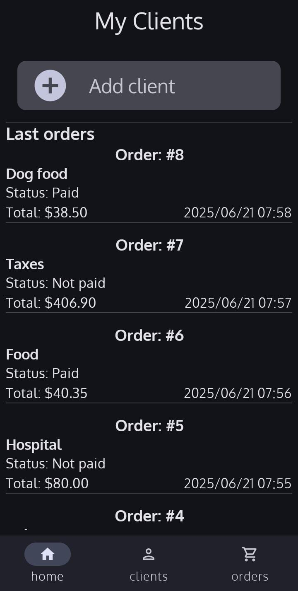
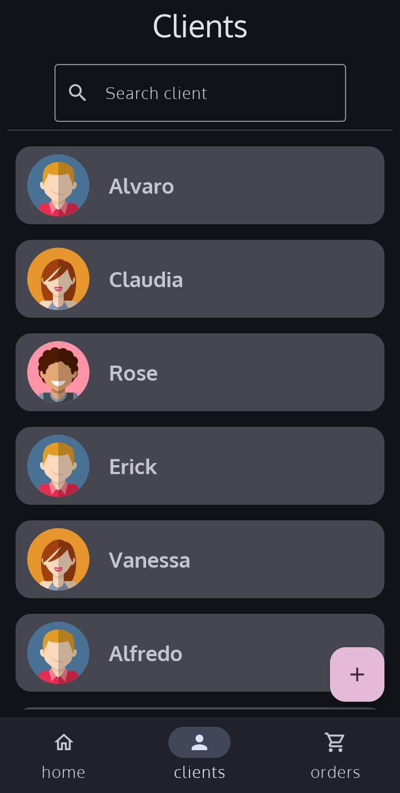
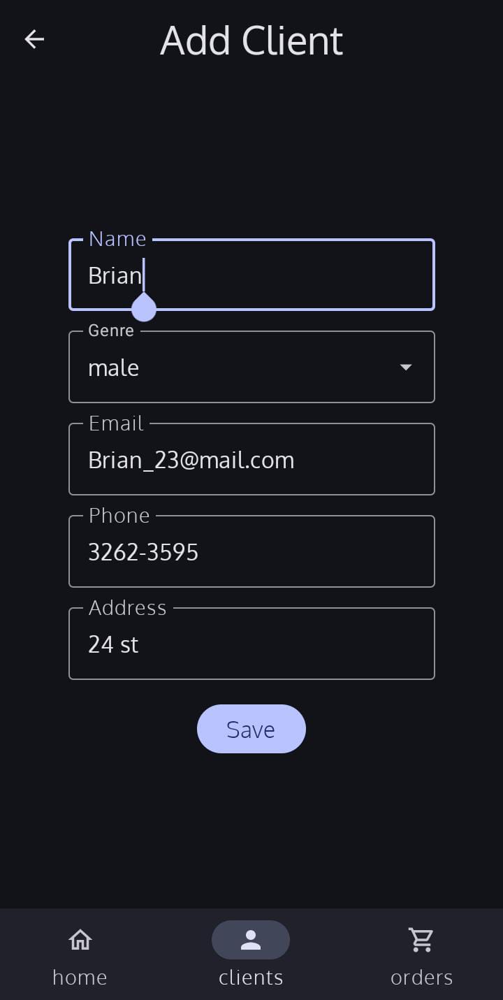
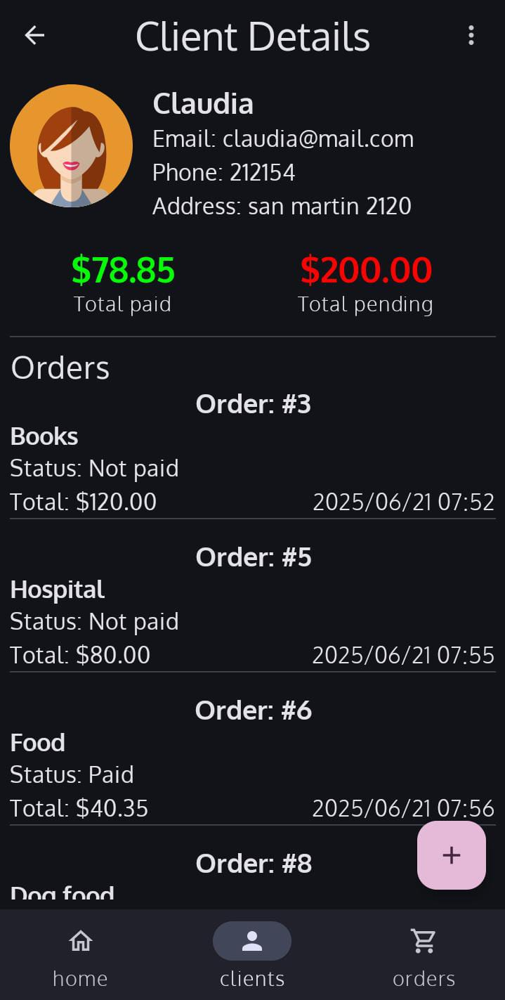
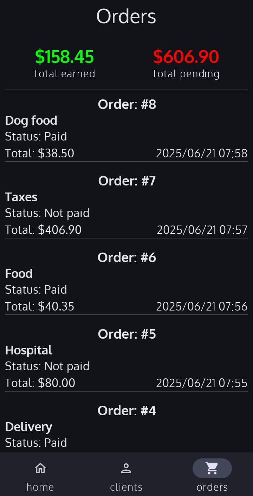
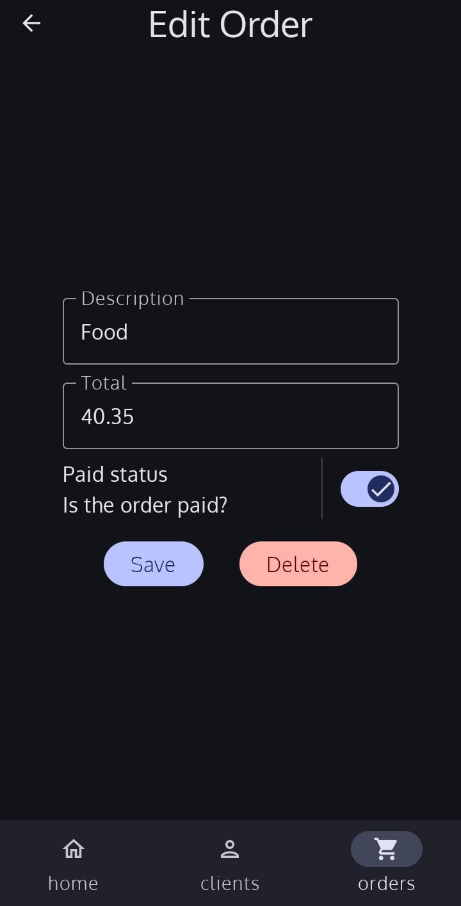

# 📋 My Clients

An Android app built with Jetpack Compose that manages clients and their orders. You can add, edit, and delete clients and orders, and track total paid and pending amounts. Uses Room for local storage and Hilt for dependency injection.
 
---

## 🚀 Features

- ✅ **Client management**: Add, edit, delete clients with name, email, phone, and address.
- 📦 **Orders tracking**: Add orders per client with description, total amount, and paid status.
- 🔍 **Search & filter**: Quickly find clients and their orders.
- 📊 **Summary views**: Display total paid vs pending amounts for clients and across all orders.

---

## 📸 Screenshots

| Clients List | Add/Edit Client | Client Details |
|--------------|------------------|------------------|
|  |  |  |

| Orders Breakdown | Add/Edit/Delete Order |
|------------------|-------------|
|  |  |

---

## 🧱 Tech Stack

- **UI**: Jetpack Compose
- **Local Database**: Room
- **DI**: Hilt
- **Architecture**: MVVM with ViewModel and StateFlow

---

## 🏛 Architecture

The app follows clean MVVM architecture:
- **UI Layer**: Composable screens observe ViewModel state and render UI.
- **ViewModel**: Handles UI events, business logic, and interacts with the repository.
- **Repository & Room**: Abstracts data storage with queries for clients and their orders.
